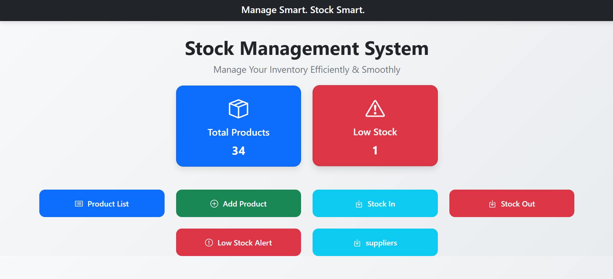
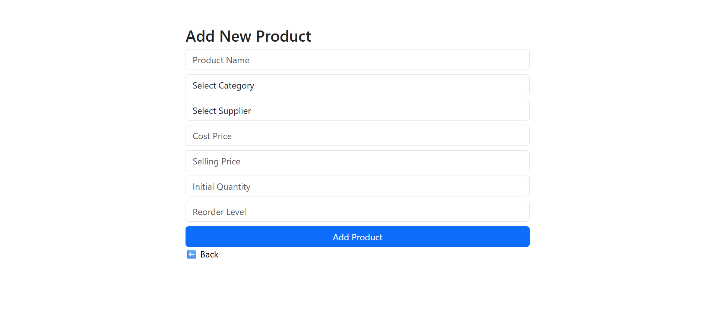
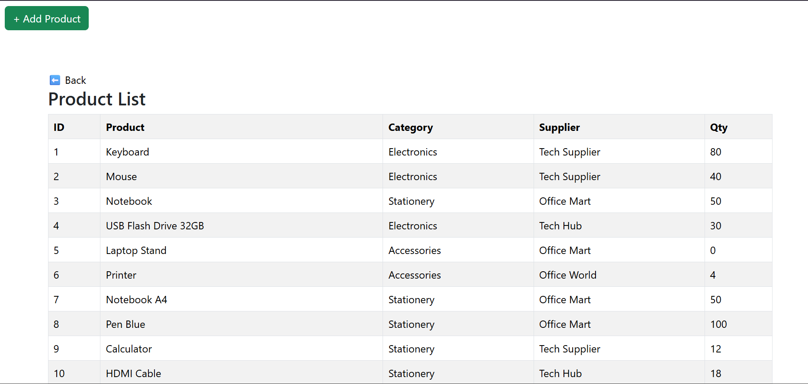
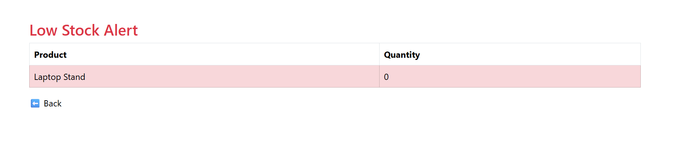
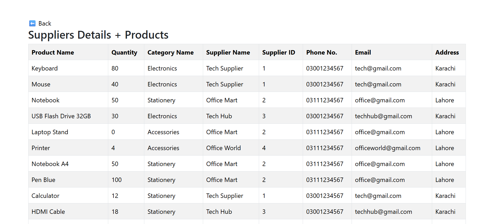

# Stock Management System

This project is a stock management system developed using PHP, SQL, and XAMPP. It provides an intuitive interface for managing inventory, suppliers, and stock movements.

## Features

- **Dashboard:** Overview of stock status, low inventory alerts, and quick access to key features.  
  
- **Add Product:** Form to add new products to the inventory.  
  
- **Products List:** View, edit, and delete existing products.  
  
- **Low Stock Alert Page:** Displays products with stock levels below the defined threshold.  
  
- **Suppliers Information Page:** Manage supplier details and contacts.  
  
- **Stock Out Page:** Remove products that are sold or removed from inventory.  
  
- **Stock In Page:** Record new stock arrivals and updates.  
  

## Technologies Used

- **PHP:** Server-side scripting for dynamic content and form processing.
- **SQL:** Database management for storing products, suppliers, and stock transactions.
- **XAMPP:** Local server environment to run and test the application.

## Setup Instructions

1. **Download and Install XAMPP:** [XAMPP Download](https://www.apachefriends.org/index.html)
2. **Start Apache and MySQL:** Launch XAMPP control panel and start the services.
3. **Import Database:** Create a database named `stock_management` and import the provided SQL file.
4. **Place Files:** Copy the project files into the `htdocs` directory of XAMPP. OR Create a new folder and then navigate to it in your browser.
5. **Access the System:** Open a browser and navigate to `http://localhost/your_project_folder/dashboard.php`.

## Note

Ensure that your database credentials in the PHP configuration files are correctly set to connect to your local MySQL server.

---

*This system aims to streamline inventory management, improve accuracy, and save time for business operations.*
